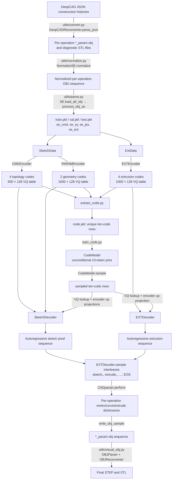

# Inherited SkexGen Repository Map

This historical reference describes the inherited SkexGen pipeline as
inspected at commit `c38f30e`. It is not a description of the newer
`prototype` research extension and does not state current project status.
It distinguishes behavior present in the inherited code from terminology
inferred from the upstream README and paper naming.

## Executive summary

SkexGen learns three discrete latent code groups:

1. **Topology:** four indices from a 500-entry codebook, produced by `CMDEncoder` from primitive-type and hierarchy-boundary commands.
2. **Geometry:** two indices from a 1,000-entry codebook, produced by `PARAMEncoder` from quantized 2D sketch pixels/coordinates.
3. **Extrusion:** four indices from a 1,000-entry codebook, produced by `EXTEncoder` from a fixed 19-value record per sketch/extrude operation.

The six sketch latents condition `SketchDecoder`; the four extrusion latents condition `EXTDecoder`. After the two VQ autoencoding branches have been trained, `extract_code.py` converts every usable training CAD model to a concatenated ten-index row:

```text
[topology x 4 | geometry x 2 | extrusion x 4]
```

`CodeModel` then learns an unconditional autoregressive distribution over those ten rows. At generation time, its sampled indices are looked up in the three learned VQ tables, projected from 128 to 256 dimensions, decoded into sketch and extrusion token sequences, interleaved, parsed into per-operation parameter OBJ data, and optionally rebuilt as STEP/STL solids.

## High-level pipeline



## Data preparation and tokenization

### 1. DeepCAD JSON to normalized operation OBJ files

- `utils/convert.py`
  - `load_json_data(pathname)` reads a DeepCAD JSON file.
  - `convert_folder_parallel(data)` creates the sample folder and calls `DeepCADReconverter.parse_json`.
  - The script scans the 100 top-level shards and skips already converted IDs.
- `utils/converter.py`
  - `DeepCADReconverter.parse_json(save_folder)` walks `data["sequence"]`, keeps `ExtrudeFeature` entries, constructs each profile and extrusion with OpenCascade, applies the chronological Boolean operation, validates it, and writes:
    - an extrusion STL,
    - a post-operation STL,
    - one `*_param.obj` containing vertices, line/arc/circle records, loop/face structure, extrusion distances, Boolean operation, and sketch-plane transform.
  - `get_ExtrudeParam`, `parse_solid`, `parse_sketch`, `parse_loop`, `parse_curve`, `create_line`, `create_arc`, `create_circle`, `extrude_face`, and `extrudeBasedOnType` implement that conversion.
- `utils/normalize.py`
  - `NormalizeSE.normalize(stl_files, extrude_param, output_folder)` chooses a global scale that fits the solid, extrusion/origin range, and sketch range; reconstructs and validates the operation sequence; then rewrites normalized OBJ parameter files.
  - `run_parallel(project_folder)` invokes it per CAD model.

The model does not train directly on JSON or B-rep objects. Its immediate source is the normalized operation OBJ sequence.

### 2. Normalized OBJ sequence to processed pickle records

- `utils/parse.py` is the CLI.
- `utils/dataset.py:SE.load_all_obj()` discovers CAD folders, calls `utils/utils.py:process_obj_se` in parallel, and uses `train_val_test_split.json` for the split.
- `utils/geometry/obj_parser.py:OBJParser.parse_file()` reads each normalized OBJ into curve objects and `meta_info`.
- `utils/utils.py` performs the canonical ordering and tokenization:
  - `sort_faces`, `sort_loops`, `sort_curves`, and `sort_start_end` canonicalize sketch traversal.
  - `convert_code(sketch, bit)` normalizes each sketch in its local 2D bounding box and calls `parse_curve`.
  - `parse_curve` represents a line with one stored point, an arc with start and midpoint, and a circle with four extremal points. Curve endpoints are recovered from the next curve's first point.
  - `process_obj_se(data)` constructs one record with:

| Field | Meaning |
|---|---|
| `name` | CAD sample ID derived from the OBJ parent path |
| `num_se` | number of sketch/extrude operations |
| `se_xy` | list of per-operation 2D coordinate-token arrays |
| `se_pix` | list of the same coordinates flattened to pixel IDs |
| `se_cmd` | list of primitive/hierarchy command arrays |
| `se_ext` | list of fixed-length 19-value extrusion records |
| `len_xy`, `len_pix`, `len_cmd`, `len_ext` | flattened lengths |

With the documented `bit=6`, coordinate components are quantized to `0…63`, and a real pixel is `y * 64 + x`, initially `0…4095`.

### Sketch token semantics

`convert_code` first emits negative structural sentinels, then `process_obj_se` adds the field-specific pads, and the root `dataset.py` adds one more `EXTRA_PAD`. The final model-facing tokens are:

| Meaning | Raw `curve_xy` / pixel sentinel | Stored `se_pix` | Model-facing pixel token |
|---|---:|---:|---:|
| global sequence EOS/padding | n/a | n/a | `0` |
| sketch end / operation separator | `-4` | `0` | `1` |
| face end | `-3` | `1` | `2` |
| loop end | `-2` | `2` | `3` |
| curve end | `-1` | `3` | `4` |
| quantized point | `0…4095` | `4…4099` | `5…4100` |

The parallel XY stream uses paired structural values and real component values `5…68`. `SketchDecoder` predicts only the pixel stream; it deterministically converts each sampled real pixel back to XY.

The command stream presented to `CMDEncoder` is:

| Meaning | Raw command | Stored `se_cmd` | Model-facing command |
|---|---:|---:|---:|
| global EOS/padding | n/a | n/a | `0` |
| sketch end | `-3` | `0` | `1` |
| face end | `-2` | `1` | `2` |
| loop end | `-1` | `2` | `3` |
| line | `0` | `3` | `4` |
| arc | `1` | `4` | `5` |
| circle | `2` | `5` | `6` |

Thus “topology” is implemented as commands encoding primitive type plus curve/loop/face/sketch boundaries. The sampled command sequence itself is not decoded; topology latents condition pixel generation, whose delimiter placement and curve lengths reconstruct the structure.

### Extrusion record semantics

Every operation contributes exactly 19 values in `process_obj_se`:

```text
positions  0:2   two extrusion bounds
positions  2:5   sketch-plane translation/origin
positions  5:14  3 × 3 rounded rotation axes
position   14    Boolean operation: add/new=1, cut=2, intersect=3
position   15    local sketch scale
positions 16:18  local sketch XY offset
position   18    operation-end sentinel
```

`ExtData`/`SketchExtData` add one extra offset, so operation end becomes token `1`, the whole extrusion sequence ends with token `0`, and quantized scalar values occupy at most `2…65` for six-bit data. Position flags repeat:

```text
[1,1, 2,2,2, 3,3,3,3,3,3,3,3,3, 4, 5, 6,6, 7]
```

They tell `EXTEncoder`/`EXTDecoder` which semantic field each scalar occupies.

### Filtering, deduplication, and validity

- `utils/deduplicate.py`
  - `hash_loop_s` hashes sketch pixel sequences.
  - `hash_loop_e` hashes extrusion sequences.
  - `parallel_hash_loops` groups hashes; the CLI retains the first row of each group and writes `train_deduplicate_s.pkl` or `train_deduplicate_e.pkl`.
- `utils/invalid.py`
  - Dataset class `SE` interleaves ground-truth sketch/extrusion tokens.
  - `raster(data)` validates them with `CADparser.perform`.
  - The CLI writes `train_invalid.pkl`.
- Root `dataset.py`
  - `SketchData` loads sketch training rows, removes invalid IDs, pads/masks commands and sketch streams, and creates quantization-noised geometry inputs.
  - `ExtData` keeps rows with at most `MAX_LEN` operations and pads/masks the extrusion stream.
  - `SketchExtData` supplies all three encoder inputs for ten-code extraction and also limits models to `MAX_EXT=5`.
  - `CodeDataset` returns rows from `code.pkl` unchanged.

## Encoders, quantization, and codebooks

All three encoders are in `model/encoder.py`. They use learned 256-dimensional token/position embeddings, a four-layer pre-norm Transformer encoder, learned latent query embeddings, a `256 → 128` projection, `VectorQuantizerEMA`, and a `128 → 256` projection. Quantization is delayed until epoch 25 (`INITIAL_PASS=25`); before that, the same down/up bottleneck is used without nearest-code lookup.

`VectorQuantizerEMA.forward(inputs)`:

1. computes squared Euclidean distance from every 128-D input to every codebook vector,
2. chooses the nearest entry,
3. updates codebook statistics by EMA while training,
4. returns commitment loss, straight-through quantized vectors, one-hot selections, and flattened selected indices.

### Codebook inventory

| Semantic group | Class | Number of latent positions | Entries per codebook | Vector size | Decoder-facing result |
|---|---|---:|---:|---:|---|
| topology | `CMDEncoder` | 4 | 500 | 128 | `[B, 4, 256]` after `up` |
| geometry | `PARAMEncoder` | 2 | 1,000 | 128 | `[B, 2, 256]` after `up` |
| extrusion | `EXTEncoder` | 4 | 1,000 | 128 | `[B, 4, 256]` after `up` |

There are **three VQ tables** and **ten selected indices per CAD model**. Each semantic group shares one table across its positions; there is not a separate table per latent position. The unconditional prior is configured with a 1,000-class vocabulary and a separate `1000 × 256` token embedding, but that embedding is not a VQ codebook.

### Exact encoder inputs and outputs

| Class / method | Input | Output |
|---|---|---|
| `CMDEncoder.forward(command, mask, epoch)` | `command: [B,Lc]` tokens `0…6`; `mask: [B,Lc]`, `True` for padding | `quantized_up: [B,4,256]`, scalar VQ loss (or `0.0` before epoch 25), selection indices or `None` |
| `CMDEncoder.get_code(command, mask, return_np)` | same command stream and mask | nearest-entry labels `[B,4]`, NumPy integers by default |
| `PARAMEncoder.forward(pixel_v, xy_v, mask, epoch)` | pixels `[B,Ls]` in `0…4100`; XY `[B,Ls,2]` in `0…68`; padding mask | `quantized_up: [B,2,256]`, VQ loss, selections |
| `PARAMEncoder.get_code(pixel_v, xy_v, mask, return_np)` | same sketch geometry streams | labels `[B,2]` |
| `EXTEncoder.forward(ext_seq, flag_seq, mask, epoch)` | extrusion values `[B,Le]` in `0…65`; field flags `[B,Le]` in `0…7`; padding mask | `quantized_up: [B,4,256]`, VQ loss, selections |
| `EXTEncoder.get_code(ext_seq, flag_seq, mask, return_np)` | same extrusion and flag streams | labels `[B,4]` |

For `bit=b` rather than six, the pixel vocabulary is `2^(2b)+5`, the coordinate vocabulary is `2^b+5`, and the extrusion vocabulary is `2^b+2`; some code paths nevertheless hard-code six bits, as noted below.

## Decoders and reconstructed CAD sequences

Both decoders are in `model/decoder.py`, use a four-layer causal Transformer decoder, and are trained by teacher-forced cross-entropy plus the associated encoder commitment loss.

### Sketch decoder

`SketchDecoder.forward(pixel_v, xy_v, pixel_mask, latent_z)`:

- Input:
  - preceding sketch pixels `[B,L]`,
  - their deterministic XY values `[B,L,2]`,
  - padding mask `[B,L]`,
  - concatenated topology and geometry memory `[B,6,256]`.
- The memory gets a learned semantic-position addition: type `0` for four topology slots and type `1` for two geometry slots.
- Output: logits `[B,L+1,2^(2b)+5]`; the extra position corresponds to a learned all-zero start context.

`SketchDecoder.sample(n_samples, latent_z, latent_ext)`:

- samples autoregressively with nucleus probability `0.5`,
- converts sampled real pixel IDs to XY,
- stops each row on token `0`,
- returns completed variable-length pixel streams and the matching extrusion latents.

### Extrusion decoder

`EXTDecoder.forward(ext_v, flags, ext_mask, code)`:

- Input:
  - preceding extrusion tokens `[B,L]`,
  - deterministic repeating field flags `[B,L]`,
  - padding mask `[B,L]`,
  - extrusion memory `[B,4,256]`.
- Output: logits `[B,L+1,2^b+2]`.

`EXTDecoder.sample(n_samples, latent_z, sample_pixels)`:

- samples with nucleus probability `0.5`,
- stops each row on token `0`,
- removes the final global EOS,
- splits the completed sketch and extrusion streams at token `1`,
- interleaves corresponding operation chunks,
- appends global token `0`,
- returns merged construction sequences:

```text
[sketch operation 1 ending in 1,
 extrusion operation 1 ending in 1,
 sketch operation 2 ending in 1,
 extrusion operation 2 ending in 1,
 ...,
 global EOS 0]
```

### Token sequence to CAD artifacts

- `sample.py:raster_cad(pixels)` calls `utils/utils.py:CADparser.perform(tokens)`.
- `CADparser.perform`:
  - removes padding after token `0`,
  - splits alternating sketch/extrusion groups on token `1`,
  - splits sketches into faces (`2`), loops (`3`), and curves (`4`),
  - infers line/arc/circle from one/two/four pixel points per curve,
  - dequantizes sketch points, local scale/offset, extrusion bounds, transform, and Boolean operation,
  - returns a chronological list of dictionaries with `vertex`, `curve`, and `extrude`.
- `utils/utils.py:write_obj_sample(save_folder, data)` writes that list as numbered `*_param.obj` operation files.
- `utils/visual_obj.py:run_parallel(project_folder)` reads those files through `OBJParser`, rebuilds each extrusion via `OBJReconverter.parse_obj`, applies Boolean operations in order, validates the solid, and writes final STEP and STL.

Therefore, the repository reconstructs:

1. a merged discrete sketch/extrude construction sequence,
2. a custom chronological parameter-OBJ representation,
3. optionally a final B-rep exported as STEP and a mesh exported as STL.

It does **not** reconstruct the original DeepCAD JSON schema.

## Ten-code extraction

`extract_code.py:extract(args)` is the complete extraction path:

1. `SketchExtData` loads `train.pkl`, excludes IDs in `train_invalid.pkl`, enforces sketch length and at most five operations, and returns command, sketch, and extrusion tensors.
2. It recreates and loads:
   - `CMDEncoder` from `cmdenc_epoch_300.pt`,
   - `PARAMEncoder` from `paramenc_epoch_300.pt`,
   - `EXTEncoder` from `extenc_epoch_200.pt`.
3. `get_code` on each encoder produces arrays of shapes `[B,4]`, `[B,2]`, and `[B,4]`.
4. `np.concatenate((cmd_code, param_code, ext_code), 1)` produces `[B,10]`.
5. `np.unique(..., axis=0)` removes duplicate ten-code rows.
6. The unique matrix is pickled to `<output>/code.pkl`.

The saved ten-code dataset is consequently a set-like collection of observed code combinations, not a frequency-preserving list of all training examples.

## Training order

The repository's intended order is:

1. **Prepare data**
   - `utils/convert.py`
   - `utils/normalize.py`
   - `utils/parse.py`
   - `utils/deduplicate.py --hash_type s`
   - `utils/deduplicate.py --hash_type e`
   - `utils/invalid.py`
2. **Train the sketch VQ autoencoder branch** with `train_sketch.py:train`
   - jointly trains `CMDEncoder`, `PARAMEncoder`, and `SketchDecoder`,
   - uses sketch-deduplicated training data,
   - 300 epochs,
   - VQ starts at epoch index 25,
   - saves all three checkpoints every 100 epochs.
3. **Train the extrusion VQ autoencoder branch** with `train_extrude.py:train`
   - jointly trains `EXTEncoder` and `EXTDecoder`,
   - uses extrusion-deduplicated training data,
   - 200 epochs,
   - VQ starts at epoch index 25,
   - saves both checkpoints every 100 epochs.
4. **Extract ten-code rows** with `extract_code.py:extract`
   - requires both trained branches,
   - writes `code.pkl`.
5. **Train the unconditional code prior** with `train_code.py:train`
   - trains `CodeModel` on ten-token rows,
   - configured from the README with sequence length 10 and 1,000 classes,
   - 800 epochs in the loop.
6. **Generate unconditionally** with `sample.py:sample`
   - loads the three encoders only for their VQ tables and `up` projections,
   - loads both decoders and `CodeModel`,
   - samples and reconstructs output CAD sequences.

Steps 2 and 3 are independent once preprocessing is complete and may be run in either order; both must finish before step 4.

## Unconditional generation, exactly

`sample.py:sample(args)` does the following:

1. Instantiates all three encoders, both decoders, and `CodeModel`.
2. Loads 300-epoch sketch weights, 200-epoch extrusion weights, and a requested 800-epoch code-prior weight.
3. Repeats until `NUM_SAMPLE=20000` accepted decoded sequences exist:
   - `CodeModel.sample(n_samples=1024)` autoregressively samples ten indices using top-p `0.99`.
   - Slice positions `0:4`, `4:6`, and `6:10`.
   - Reject a row if any topology index is at least 500. Geometry and extrusion indices already fit their 1,000-entry tables.
   - Look up code vectors in `cmd_encoder.vq_vae._embedding`, `param_encoder.vq_vae._embedding`, and `ext_encoder.vq_vae._embedding`.
   - Apply each encoder's `up` projection to obtain 256-D decoder memories.
   - Concatenate topology and geometry memories and call `SketchDecoder.sample`.
   - Carry the matched extrusion memory through sketch completion and call `EXTDecoder.sample`.
4. Parse completed merged token sequences in a process pool with `raster_cad`.
5. Write each valid parsed construction sequence as a folder of parameter OBJ files with `write_obj_sample`.

`CodeModel.forward(code)` is a decoder-only causal Transformer implemented using a dummy zero memory. It receives a zero start context plus previous code tokens and returns next-token logits. `CodeModel.sample` always emits exactly `max_len=10` tokens; there is no EOS in code space.

`model/code.py:CondARModel` implements a conditional alternative, but no training or sampling CLI in this repository uses it. It is outside the documented unconditional pipeline.

## File-by-file map

### Entry points and datasets

| File | Role |
|---|---|
| `README.md` | Intended preprocessing, training, extraction, generation, visualization, and evaluation commands. |
| `dataset.py` | Runtime PyTorch datasets: `SketchData`, `ExtData`, `SketchExtData`, and `CodeDataset`; adds final token offsets, masks, padding, flags, and sketch augmentation. |
| `train_sketch.py` | Joint topology encoder + geometry encoder + sketch decoder training and validation. |
| `train_extrude.py` | Joint extrusion encoder + extrusion decoder training and validation. |
| `extract_code.py` | Loads trained encoders, extracts `[4+2+4]` code indices, deduplicates rows, writes `code.pkl`. |
| `train_code.py` | Trains the unconditional ten-token `CodeModel`. |
| `sample.py` | Loads all pretrained components, samples ten-code rows, decodes and writes generated parameter OBJ sequences. |
| `requirements.txt` | Python package list; PyTorch and pythonocc are installation prerequisites described separately in the README. |
| `LICENSE` | Project license. |
| `.gitignore` | Ignores contents of `data/` and `proj_log/`. |
| `data/.gitkeep` | Placeholder for external raw/processed data. |

### Models

| File | Role |
|---|---|
| `model/encoder.py` | `VectorQuantizerEMA`; topology `CMDEncoder`; geometry `PARAMEncoder`; extrusion `EXTEncoder`; learned embeddings and positions. |
| `model/decoder.py` | `SketchDecoder`, `EXTDecoder`, top-p filtering, teacher-forced forward passes, and variable-length sampling. |
| `model/code.py` | Unconditional `CodeModel`, unused-by-CLI `CondARModel`, and code-space top-p sampling. |
| `model/layers/improved_transformer.py` | Pre-norm encoder/decoder layers used by all pipeline models. |
| `model/layers/transformer.py` | Stacked encoder/decoder wrappers and cloning utilities used by the pipeline. |
| `model/layers/attention.py` | Local `MultiheadAttention` wrapper. |
| `model/layers/functional.py` | Local multi-head-attention implementation called by `attention.py`. |
| `model/layers/positional_encoding.py` | Standalone sinusoidal/LUT positional classes; the main model files define and use their own learned `PositionalEncoding`. |
| `model/layers/utils.py` | Attention-mask helpers; not directly imported by the main entry points. |

### Preprocessing, reconstruction, and evaluation

| File | Role |
|---|---|
| `utils/convert.py` | CLI from DeepCAD JSON folders to per-operation OBJ/STL data. |
| `utils/converter.py` | OpenCascade conversion in both directions: `DeepCADReconverter` for source JSON and `OBJReconverter` for normalized/generated parameter OBJ. |
| `utils/normalize.py` | Normalizes CAD scale/ranges, reconstructs for validation, and rewrites normalized operation OBJ files. |
| `utils/parse.py` | CLI that converts normalized OBJ folders into split pickle datasets. |
| `utils/dataset.py` | Preprocessing `SE` orchestrator; parallel `process_obj_se` calls and train/validation/test split. |
| `utils/utils.py` | Central representation logic: OBJ writing, canonical ordering, quantization, `convert_code`, `process_obj_se`, `CADparser`, and scheduler helper. |
| `utils/deduplicate.py` | Sketch/extrusion/full-sequence hashing and deduplicated training pickle creation. |
| `utils/invalid.py` | Ground-truth token reconstruction check and invalid-ID pickle creation. |
| `utils/visual_obj.py` | Rebuilds generated parameter OBJ operation sequences into validated final STEP/STL solids. |
| `utils/cad_img.py` | Renders STEP files to PNG; currently slices the discovered list to entries 1000–1999. |
| `utils/sample_points.py` | Samples 2,000 surface points from final STL files and writes PLY point clouds. |
| `utils/eval_cad.py` | Computes point-cloud MMD-CD, COV-CD, and JSD. |
| `utils/geometry/obj_parser.py` | Parses custom OBJ vertices, face/loop/curve records, transforms, and extrusion metadata. |
| `utils/geometry/curve.py` | Base `Curve` and bounding-box helper. |
| `utils/geometry/line.py` | `Line` geometry record. |
| `utils/geometry/arc.py` | `Arc` geometry record. |
| `utils/geometry/circle.py` | `Circle` geometry record and its four extremal points. |
| `utils/geometry/geom_utils.py` | Additional angle, quantization, centering, and scaling helpers; largely separate from the central duplicated helpers in `utils/utils.py`. |
| `utils/geometry/obj_utils.py` | Incomplete/legacy wire-OBJ helpers; `read_wire_obj` references undefined locals and contains `pdb.set_trace`, so it is not part of the working pipeline. |

## Uncertainties and implementation caveats

1. **Checkpoint mismatch in the code prior.** `train_code.py` loops for 800 epochs but saves only when `(epoch+1) % 500 == 0`; it therefore writes `code_epoch_500.pt`, not `code_epoch_800.pt`. `sample.py` tries to load `code_epoch_800.pt`. An 800 checkpoint must come from an unshown change/manual save or the checked-in scripts do not connect as written.
2. **Six-bit assumptions are not consistently parameterized.**
   - `SketchData` augmentation clips to `2**6-1`.
   - `extract_code.py` constructs `EXTEncoder(quantization_bits=6)` even though it accepts `--bit`.
   - The published commands use `--bit 6`, which is the only configuration clearly consistent across the full path.
3. **Meaning of “topology.”** The repository names the class `CMDEncoder`, while the README calls it the topology encoder. The mapping is well supported by the command content, but there is no class literally named `TopologyEncoder`.
4. **No standalone command decoder.** Topology commands supervise only `CMDEncoder`. Reconstruction relies on the sketch pixel decoder to emit curve/loop/face/sketch delimiters and on curve point count to infer primitive type.
5. **Code extraction changes the empirical distribution.** `np.unique(axis=0)` discards multiplicities before prior training, so frequent ten-code combinations do not receive greater weight.
6. **The shared 1,000-class prior has no position-specific validity mask.** Topology positions should be `<500`; generation samples from all 1,000 classes and rejects complete rows with an out-of-range topology value afterward.
7. **Potential empty accepted batch.** If every sampled row has an invalid topology index, `torch.vstack(cmd_codes)` in `sample.py` receives an empty list.
8. **Maximum-length failures are silently dropped.** `SketchDecoder.sample` and `EXTDecoder.sample` append only rows that sample EOS before their configured maximum length.
9. **Operation pairing can truncate.** `EXTDecoder.sample` interleaves `zip(pix_splits, ext_splits)` without explicitly asserting equal operation counts. Later parsing/solid reconstruction may reject malformed results.
10. **Hard-coded inference lengths.** `sample.py` uses sketch length 200, command length 124, and extrusion length 96 rather than reading shape metadata from checkpoints or a saved configuration.
11. **`CodeDataset.maxlen` is stored but unused.** The ten-row length is assumed to match `CodeModel.max_len`.
12. **GPU/device assumptions.** Model methods allocate tensors with direct `.cuda()` calls; CPU execution and general device placement are not supported without changes.
13. **Source dataset artifacts and checkpoints are external.** No processed pickle, split JSON, pretrained weights, or generated examples are present in this checkout, so shapes and flows were verified statically rather than by executing the CUDA pipeline.
14. **OBJ is a custom intermediate, not conventional final CAD history.** Its face/loop/curve and extrusion metadata are sufficient for this repository's `OBJReconverter`, but it is not the original DeepCAD JSON construction record.
15. **Some utilities are visibly legacy/debug code.** `utils/geometry/obj_utils.py` is incomplete; `utils/cad_img.py` renders only a hard-coded slice. Neither affects the central training/generation path.
